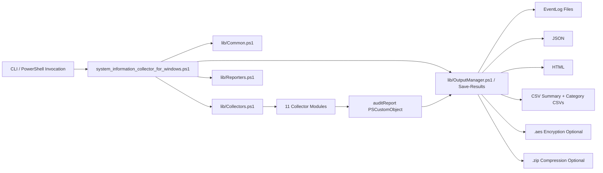
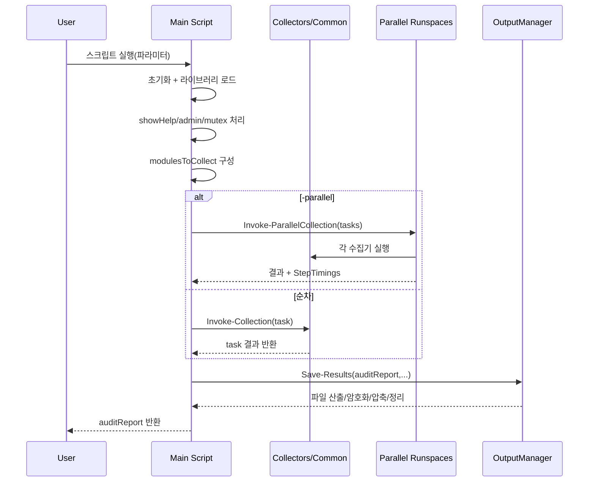
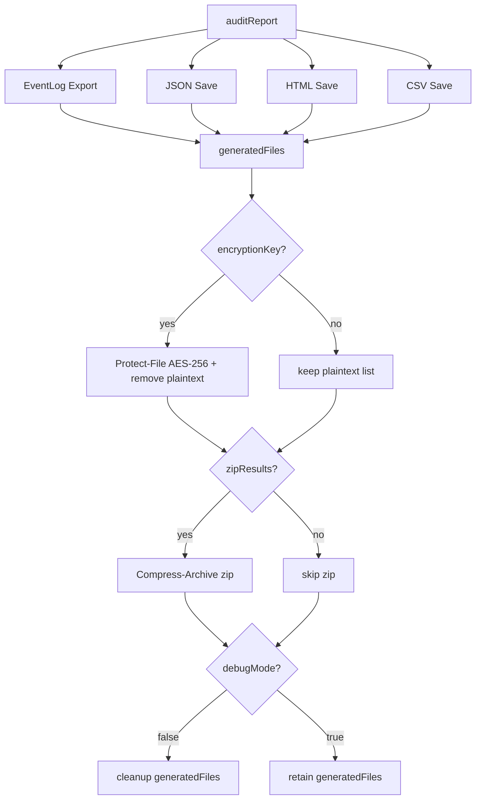

# 시스템 정보 수집기 코드 명세서 (As-Is)

작성일: 2026-02-19  
코드 기준: `b3060ff` (`2026-02-14`)  
기준 엔트리: `system_information_collector_for_windows.ps1`

## 1. 문서 목적과 범위
이 문서는 현재 저장소 구현(As-Is)을 기준으로 다음을 정리한다.
- 실행 계약(CLI 인자, 실행 전제, 제어 흐름)
- 런타임 공통 유틸(로깅, 에러 처리, 병렬 실행, 싱글턴 제어)
- 11개 수집 모듈의 반환 스키마
- 결과 저장 파이프라인(JSON/HTML/CSV/EventLog/암호화/압축/정리)
- 테스트 커버리지와 코드-테스트 불일치 지점

제외 범위:
- 배포 자동화/CI 파이프라인
- 설치 가이드/운영 매뉴얼 상세

---

## 2. 시스템 아키텍처

### 2.1 컴포넌트 구성
- 진입점: `system_information_collector_for_windows.ps1`
- 공통 런타임: `lib/Classes.ps1`, `lib/Common.ps1`
- 수집기 로더: `lib/Collectors.ps1`
- 리포터 로더: `lib/Reporters.ps1`
- 출력 관리자: `lib/OutputManager.ps1`
- 수집기 구현: `lib/collectors/*.ps1` (11개)
- 리포터 구현: `lib/reporters/*.ps1` (HTML/CSV/EventLog)
- 복호화 유틸: `utils/Decrypt-Results.ps1`

### 2.2 아키텍처 도식


---

## 3. 실행 시퀀스

### 3.1 제어 흐름
1. 전역 상태 초기화(`$script:DebugMode`, `$script:DebugLogFile`, `$script:generatedFiles`, `$script:StepTimings`)
2. 출력 디렉터리 존재 확인 및 필요 시 생성
3. 라이브러리 dot-source 로드
4. `-showHelp`면 로케일 문서 열고 종료
5. 관리자 권한 확인(`Assert-AdminPrivileges`)
6. Mutex 획득(`Get-ScriptMutex`)
7. `-Encrypt` 활성 시 키 입력(`Read-Host -AsSecureString`)
8. 모듈 목록 구성(`ALL` 또는 선택 모듈)
9. 수집 실행(순차 또는 병렬)
10. `Save-Results`로 결과 직렬화/암호화/압축/정리
11. finally에서 Mutex 해제 및 GC 수행

### 3.2 시퀀스 도식


---

## 4. 엔트리포인트/CLI 계약

### 4.1 파라미터
| 파라미터 | 타입 | 기본값 | 제약 |
|---|---|---|---|
| `-outputFormat` | `string[]` | `@("HTML")` | `JSON`, `HTML`, `CSV`, `ALL` |
| `-eventLogFormat` | `string` | `HTML` | `HTML`, `CSV` |
| `-modules` | `string[]` | `"ALL"` | 11개 모듈명 + `ALL` |
| `-outputPath` | `string` | `$PSScriptRoot` | 유효성 약검증, 없으면 생성 시도 |
| `-Compress` | `switch` | `false` | ZIP 생성 |
| `-Encrypt` | `switch` | `false` | SecureString 키 필요 |
| `-debugMode` | `switch` | `false` | 디버그 로깅/메모리 타이밍 |
| `-parallel` | `switch` | `false` | runspace pool 병렬 수집 |
| `-showHelp` | `switch` | `false` | locale 문서 열기 |
| `-WhatIf`, `-Confirm` | Common | N/A | `CmdletBinding(SupportsShouldProcess)` 지원 |

### 4.2 모듈 선택 규칙
허용 모듈: `Hardware`, `Network`, `OSConfig`, `Inventory`, `Virtualization`, `Services`, `Performance`, `Logs`, `Security`, `ActiveDirectory`, `HighAvailability`, `ALL`

---

## 5. 공통 런타임 규격

### 5.1 클래스 기반 규약
- `BaseCollector`(`lib/Classes.ps1`)를 상속하여 수집기 구현
- 필수 메서드: `Collect()`
- 공통 로깅: `LogStart()`, `LogEnd(ms)`

### 5.2 핵심 함수(`lib/Common.ps1`)
- `Get-CimSafe`: CIM 예외 흡수 + 빈 배열 반환
- `Write-Log`: 콘솔 출력 + 디버그 파일 로그(재시도 3회)
- `Assert-AdminPrivileges`: 관리자 미실행 시 즉시 종료
- `Assert-Prerequisites`: PS 버전/winmgmt/디스크 검사 함수(현재 엔트리에서 호출되지 않음)
- `Get-MaskedValue`: 민감 키워드 마스킹
- `Get-ScriptMutex`: `Global\SystemInfoCollector_Mutex` 선점, 실패 시 local fallback
- `Invoke-Collection`: 실행시간/메모리/타입/카운트 추적, 실패 시 `Error: ...` 문자열 반환
- `Invoke-ParallelCollection`: `RunspacePool` 기반 병렬 실행, 작업별 300초 타임아웃
- `Open-LocalizedDoc`: `PSCulture` 우선, `ko-KR`/`en-US` fallback

---

## 6. 수집 모듈 명세 (현재 반환 스키마)

| 모듈 | Wrapper | 핵심 반환 키 | 특이사항 |
|---|---|---|---|
| Hardware | `Get-HardwareInfo` | `BIOS`, `Processor`, `PhysicalMemory`, `DiskDrive`, `LogicalDisk`, `PnPEntities` 등 | Win32_* 기반 CIM 수집 |
| Network | `Get-NetworkInfo` | `Adapters`, `Configuration`, `Routing`, `Netstat`, `DnsClient`, `Sharing` | SMB/NFS cmdlet 부재 시 문자열 메시지 반환 |
| OSConfig | `Get-OSConfig` | `OperatingSystem`, `SecureBoot`, `AutoRuns`, `SystemHealth`, `DotNetVersions`, `DismFeatures`, `DismCapacity` 등 | `AutoRuns`/환경변수는 마스킹 적용 |
| Virtualization | `Get-VirtualizationInfo` | `HyperV`, `WindowsContainers`, `WSL` | 도커/Hyper-V/WSL 가용성에 따라 하위 구조가 가변 |
| Services | `Get-ServiceInfo` | `Services`, `Processes`, `DTC`, `ScheduledTasks`, `Drivers` | `Processes.WorkingSet` MB 변환 |
| Performance | `Get-PerformanceInfo` | `RawCpu`, `RawMemory`, `TopProcesses`, `LeakDiagnostics` | 핸들 누수 진단 포함 |
| Logs | `Get-LogInfo` | `NTEventLogInfo`, `Hotfixes`, `EventLogs`, `WindowsUpdate` | 최근 7일 Level 1~3, 기본 100건(로그 >1GB면 50건) |
| Security | `Get-SecurityInfo` | `FirewallProfile`, `AntivirusStatus`, `BitLockerStatus`, `EntraIdStatus`, `AuditPolicy`, `UserRights` 등 | `secedit`, `auditpol`, `dsregcmd` 등 외부 커맨드 활용 |
| Inventory | `Get-InventoryInfo` | `InstalledSoftware`, `AppxPackages` | SW 중복 제거(`DisplayName+Version+Publisher`) |
| ActiveDirectory | `Get-ActiveDirectoryInfo` | `Environment`, `Availability`, `Domain`, `Forest`, `DomainControllers`, `Trusts`, `ObjectSummary` | 샘플 한도 5000, 도메인 미가입 시 조기 반환 |
| HighAvailability | `Get-HighAvailabilityInfo` | `Cluster`, `NicTeaming`, `MCCS`, `ExternalSan` | FailoverClusters 있으면 `Get-ClusterLog` 수행 |

---

## 7. 출력/리포팅 규격

### 7.1 파일명 규칙
- 메인 리포트: `result_yyyyMMddHHmmss.(json|html|csv|zip)`
- 이벤트 로그: `Log_<SafeLogName>.(html|csv)`
- 암호화: 원본 파일명 + `.aes`

### 7.2 `Save-Results` 파이프라인


### 7.3 `WhatIf` 반영 수준 (실제 코드 기준)
| 단계 | `ShouldProcess` 적용 |
|---|---|
| EventLog Export | 적용 |
| JSON 저장 | 미적용 (`Set-Content` 직접 호출) |
| HTML 저장 | 적용 |
| CSV 저장 | 적용 |
| AES 암호화 | 적용 |
| ZIP 압축 | 적용 |
| Cleanup | 적용 |

### 7.4 암호화/복호화
- 암호화(`Protect-File`): AES-256 + PBKDF2(100,000회), 파일 헤더 `Salt(16)+IV(16)+Cipher`
- 복호화(`utils/Decrypt-Results.ps1`): `.aes`만 직접 처리, `.zip`은 선해제 후 복호화

---

## 8. 보안 제어 명세
- 수집기 플러그인(`lib/collectors/*.ps1`)은 Authenticode `Valid`만 로드
- 서명 불일치 시 로드 거부 및 경고 출력
- 민감 문자열 마스킹(`Get-MaskedValue`)
- 관리자 권한 강제
- Mutex로 중복 실행 방지
- 선택적 파일 암호화(AES-256)

참고:
- 리포터 로더(`lib/Reporters.ps1`)는 수집기 로더와 달리 서명 검증 로직이 없다.

---

## 9. 오류/예외 처리 정책
- 수집 단계는 가능한 예외 흡수 후 부분 결과를 유지(빈 배열 또는 `Error:` 문자열)
- 병렬 단계는 작업별 실패를 결과 객체에 격리
- 출력 단계(`Save-Results`)는 내부 `catch`에서 `Write-Error`만 수행하고 재throw하지 않음
- 최종 `finally`에서 Mutex 해제 및 GC 정리

---

## 10. 테스트 전략/커버리지

### 10.1 테스트 프레임워크
- 엔트리: `tests/Comprehensive.Tests.ps1`
- 프레임워크 클래스: `TestResult`, `BaseTest`, `TestRunner`

### 10.2 테스트 그룹
- Infrastructure: Admin 권한, Mutex 격리
- Security: Authenticode 검증, DLP 마스킹
- Integrity/Compliance: AES round-trip, 클래스 로딩/상속, 로그 가드
- EdgeCase-P0: WMI 손상, 서명 변조, 디스크 부족 시나리오

---

## 11. 현재 코드 기준 갭/운영 주의사항

1. `Assert-Prerequisites()`가 구현되어 있으나 메인 실행 경로에서 호출되지 않는다.
2. `Save-Results`는 `debugMode=false`일 때 `generatedFiles`를 정리한다.
   - `zipResults=false`인 기본 실행에서는 최종 산출물까지 삭제될 수 있다.
3. `Save-Results`의 JSON 저장 경로는 `ShouldProcess` 보호를 받지 않아 `-WhatIf`에서도 파일이 생성될 수 있다.
4. 리포터 모듈 로딩은 서명 검증을 수행하지 않는다(수집기 로더와 정책 불일치).
5. `HighAvailability` 모듈은 `parallel` 실행 시 출력 경로 전달이 약해 클러스터 로그 생성 경로가 기본값(`$PSScriptRoot`)으로 떨어질 수 있다.
6. `NetworkCollector`의 NFS 마운트 조회는 `Get-NfsMountedIt` 명령명을 사용한다.
   - 환경에 따라 항상 fallback 문자열이 반환될 수 있다.
7. `tests/lib/EdgeCaseTests.ps1`의 `DiskFullSimulationTest`는 현재 `Save-Results` 시그니처와 불일치하는 호출 코드가 포함되어 있다.

---

## 12. 최종 결과 객체 스키마

`$auditReport`는 최소 아래 공통 필드를 가진다.

```text
Timestamp: DateTime
ExecutionTime: string (hh:mm:ss.fff)
```

선택된 모듈만 동적으로 추가된다.

```text
Hardware, Network, OSConfig, Virtualization, Services,
Performance, Logs, Security, Inventory, ActiveDirectory, HighAvailability
```

---

## 13. 운영 체크리스트
- [ ] 관리자 권한으로 실행
- [ ] `outputPath` 쓰기 권한 및 디스크 여유(최소 150MB) 확인
- [ ] 필요한 모듈만 `-modules`로 제한해 실행 시간/출력량 제어
- [ ] 민감 데이터 포함 가능 환경에서는 `-Encrypt` + 키 관리 정책 적용
- [ ] 결과물을 반드시 남겨야 하면 `-Compress` 또는 `-debugMode` 정책 확인
- [ ] `-parallel` 사용 시 CPU/메모리 사용량 모니터링
- [ ] AD/HA 수집 시 RSAT/FailoverClusters 사전 점검
